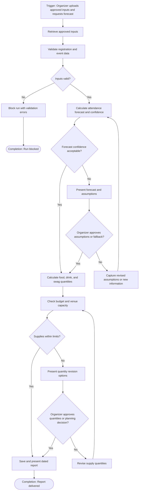

# Workflow of Tasks

*Replace all bracketed prompts with information specific to your proposed system. Delete instructional text that does not belong in your final specification. Add or remove task sections as needed. Every task shown in the general workflow must have a corresponding task specification below.*

## 1. Workflow Overview
### 1.1 Workflow Goal
This workflow supports the system goal defined in `my_first_agent/README.md`.

### 1.2 Workflow Trigger

Workflow begins when all data is registered and attendance is requested.

### 1.3 Completion Condition at Runtime

A run is complete when HackTrack has either saved or presented a dated report after the organizer has approved the forecast assumptions and any supply-planning decision, or blocked the run with validation errors because required inputs are invalid. If revised assumptions or quantities are needed, the run remains in progress until they are captured, recalculated or rechecked, and approved. 

### 1.4 General Workflow

On each run, HackTrack retrieves the approved registration and event inputs and validates the data. If the inputs are invalid, HackTrack blocks the run and reports the validation errors. If the inputs are valid, HackTrack calculates the attendance forecast and confidence level.
If forecast confidence is acceptable, HackTrack converts the forecast into recommended food, drink, and swag quantities. If confidence is low, HackTrack presents the forecast and assumptions to the organizer for review. The organizer either approves the assumptions or fallback decision, or provides revised assumptions or new information. HackTrack captures the revisions and recalculates the forecast before continuing.
HackTrack checks the recommended supply quantities against the available budget and venue capacity. If the quantities are within limits, HackTrack saves and presents the dated report. If the quantities exceed a limit, HackTrack presents quantity-revision options. The organizer either approves revised quantities or records a planning decision, or revises the quantities. Revised quantities are checked again until they are acceptable or the organizer approves a planning decision. The final report includes the forecast, assumptions, supply quantities, budget and capacity checks, planning decisions, and warnings.

### 1.5 Workflow Diagram

